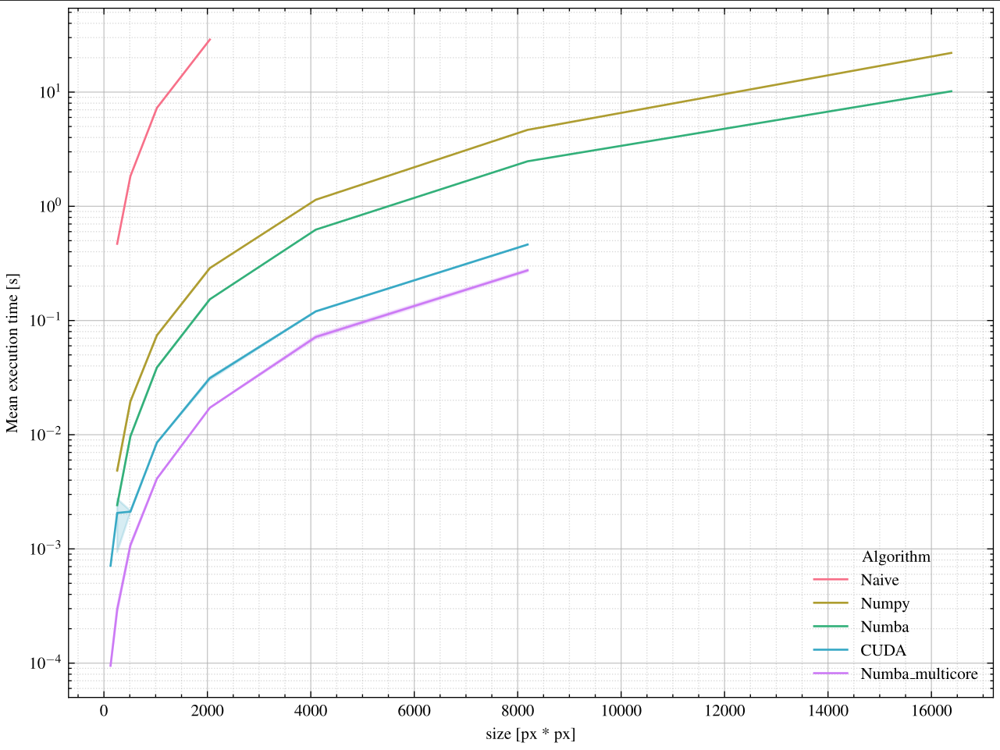

# Part two: JPG

Hi, For part two the following implementations have been written:
- Naive compression with explicit for loops for matrix operations
- Compression with Numpy matrix operations
- Compression Numba on a single core
- Compression with CUDA where each block is handed to a GPU core (seems to be best for large images) utilzing many cores
- Compression with Numba on multiple cores.

Please note that timing is divided into two segments, one called t_setup, and t_meas. For some of the applications the overhead of setup seems to shine through the performance gain of the parallelization itself. So these were split op, beacuse i do believe faster methods for setting up these data exist... 

Further the implementation of the CUDA was written first, this is probably not the most scientific (but it was the most fun to make ;) ). And the other implementations are somewhat copy paste and fitted for their respective framework, this might be root for some issues.

The apperent performance i was able to test on a empty debian installation with a i7-4770k and GTX960OC (What can be expected as old hardware)

## In these folders you will find

- `/results` contains my pandas dataframes with the benchmarks i ran.
- `/test_images` are just some dumb test images i used for seeing if the algortihm worked.
- `/src` the source code and testbenches

Only compression (*DCT and quantiation) have been implemented, the inverse operation was written by an avalible chatbot (it was surprisingly good at it though), and IS NOT benchmarked. 
- `testbench.py` is a loop to run through all the algorithms x times, for a given image size, (set the size on line 25-26 ish), and choose algorithms from the dictionary (line 29 ish)
- `tester_compression.py` runs a single compression and decompression and saves the image, it was just used for testing and development
- `plotter.py` is for generating the plots illustrated below, i got a bit carried away so it requires latex to run... but that can probably be disabled by commenting out `plt.style.use(["science", "ieee"])`
- `converters.py` is just helpers for the DCT matrices, and partitioning the image.
- `Cuda_compression.py` actual impementation fitted to the `compress()` interface chosen to be commmon for all algorithms
- `Naive_compression.py` same story as above
- `Numba_compression.py` same story as above
- `Numba_P_compression.py` same story as above except with multicore
- `Numpy_compression.py` same story as above

## Apperent results yay
These are the run times without apperent setup time.

## Acknowledgements
I would like to give a special thanks to my group-mate mikkel for donating his lovely selfie to the test-set.

Br. Malthe