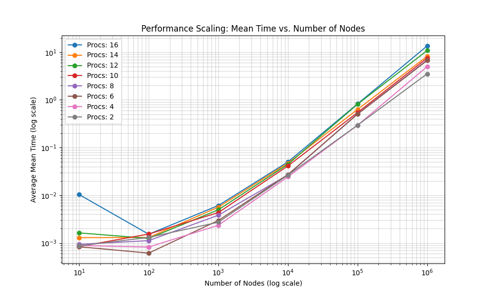

# Current state for the HPP workshop

## Exercise 1
### subproblem A
Nothing is really that interesting about this one instance, see problem 1C
### subproblem B

### subproblem C

## Exercise 2

## In these folders you will find
- In `problem1` is the code for each subproblem, for each subfolder there should be an associated readme.md describing how to run and what to expect
- In `problem2` is the code for problem2, in here you will find a detailed readme as well along with preliminary results, graphs, testdata and testbench.

Br. ESD625 + Magnus :)
